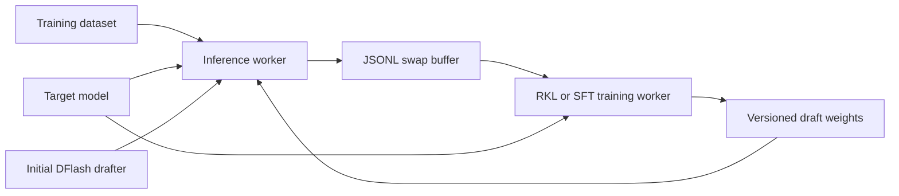

# AdaFlash Pipeline Guide

This document describes the repository's asynchronous inference and training pipeline. The inference worker produces target-model trajectories in a swap buffer, while the training worker consumes those trajectories, updates the diffusion drafter and adaptive length head, and publishes new draft checkpoints for hot reloading.

All commands in this document assume that the current working directory is the repository root.

## Architecture



The main components are:

1. **Inference worker** — runs the target model and DFlash drafter through SGLang, generates responses, and writes training trajectories to `SWAP_DIR/data_buffer/`.
2. **Training worker** — waits for enough buffered samples, trains with SFT or reverse KL, and writes updated weights to `SWAP_DIR/model_weights/`.
3. **Hot-reload protocol** — a `version.txt` marker identifies the latest complete checkpoint. The inference worker reloads a new draft only after publication is complete.
4. **Adaptive length head** — predicts how many candidate tokens should be verified for each request, reducing unnecessary target-model verification.

## Repository Layout

```text
.
├── bin/                         # Thin Python command-line entry points
│   ├── benchmark.py
│   ├── inference_worker.py
│   ├── prepare_data.py
│   ├── regenerate_dataset.py
│   ├── training_worker_rkl.py
│   └── training_worker_sft.py
├── configs/                     # DFlash and adaptive-length configurations
├── pipeline/                    # Core Python implementation
│   ├── benchmark/               # HTTP benchmark client
│   ├── data/                    # Dataset download and normalization
│   ├── inference/               # Inference and regeneration workers
│   ├── offline/                 # Offline initialization and training
│   └── training/                # Async SFT/RKL training loop
├── recipes/                     # Model- and dataset-specific launch recipes
├── scripts/
│   ├── lib/                     # Shared shell environment and path helpers
│   ├── offline/                 # Offline initialization/training launchers
│   ├── pipeline/                # Async OSD and AdaFlash launchers
│   ├── serve/                   # SGLang serving launchers
│   └── tools/                   # One-command benchmark and maintenance tools
├── specforge/                   # Minimal vendored SpecForge subset
├── cache/                       # Prepared training data
├── test_data/                   # Prepared benchmark splits
└── docs/                        # Project documentation
```

## Main Entry Points

| Task | Entry point |
|---|---|
| Prepare train and benchmark datasets | `python bin/prepare_data.py` |
| Regenerate a training JSONL file | `python bin/regenerate_dataset.py` |
| Run the async inference worker | `python bin/inference_worker.py` |
| Run async reverse-KL training | `python bin/training_worker_rkl.py` |
| Run async SFT training | `python bin/training_worker_sft.py` |
| Initialize the adaptive length head | `python -m pipeline.offline.init_thresh_head` |
| Run the HTTP benchmark client | `python bin/benchmark.py` |

The files under `bin/` are intentionally thin. Reusable implementation code lives under `pipeline/`.

## Quick Start

Prepare a dataset first:

```bash
python bin/prepare_data.py --dataset gsm8k
```

Run AdaFlash inference and reverse-KL training asynchronously:

```bash
export MODEL_PATH=Qwen/Qwen3-8B
export INITIAL_DRAFT_PATH=/path/to/initialized/draft
export DRAFT_CONFIG_PATH="$PWD/configs/qwen3-8b-dflash-thresh-head.json"
export DATASET_PATH="$PWD/cache/dataset/gsm8k_train.jsonl"
export SWAP_DIR="$PWD/outputs/qwen3_8b_gsm8k"
export LOG_DIR="$PWD/logs/qwen3_8b_gsm8k"

# Inference uses GPU 0; distributed training uses GPUs 1 and 2.
bash scripts/pipeline/run_async_pipeline_adaflash.sh "0" "1,2"
```

The first launcher argument is a comma-separated inference GPU list. The second is a comma-separated training GPU list.

## Runtime Directories

Given `SWAP_DIR=/path/to/run`, the pipeline maintains the following state:

```text
/path/to/run/
├── data_buffer/                 # JSONL trajectories awaiting training
├── model_weights/               # Latest hot-reloadable draft checkpoint
├── draft_models/                # Optional versioned snapshots
├── stop_pipeline                # Cooperative stop marker
└── ...
```

Do not publish partially written weights directly into `model_weights/`. The training code writes checkpoint state and version metadata in the order expected by the inference worker.

## Configuration

The pipeline launchers are configured through environment variables. Frequently used settings include:

### Paths and models

| Variable | Purpose |
|---|---|
| `MODEL_PATH` | Target autoregressive model |
| `INITIAL_DRAFT_PATH` | Initial DFlash/AdaFlash drafter |
| `DRAFT_CONFIG_PATH` | Draft architecture configuration |
| `DATASET_PATH` | Normalized training JSONL file |
| `SWAP_DIR` | Shared inference/training state |
| `LOG_DIR` | Inference and training logs |

### Inference

| Variable | Default | Purpose |
|---|---:|---|
| `INFER_MAX_NEW_TOKENS` | `2048` | Maximum generated tokens per request |
| `INFER_TEMPERATURE` | `0.0` | Sampling temperature |
| `INFER_MEM_FRACTION` | `0.80` | SGLang inference memory fraction |
| `THRESH_HEAD_THRESHOLD_RATE` | `1.3` | Adaptive-length threshold multiplier |
| `ENABLE_THINKING` | `0` | Enable the model's thinking chat template |

### Training

| Variable | Default | Purpose |
|---|---:|---|
| `TRAIN_THRESHOLD` | `128` | Buffered samples required before training |
| `TRAIN_BATCH_SIZE` | `1` | Per-process micro-batch size |
| `TRAIN_LR` | `3e-4` | Drafter learning rate |
| `THRESH_HEAD_LR` | `2e-4` | Adaptive length-head learning rate |
| `TRAIN_MAX_LENGTH` | `2048` | Maximum training sequence length |
| `TRAIN_BUFFER_EPOCHS` | `2` | Passes over each consumed buffer batch |
| `TRAIN_GRADIENT_ACCUMULATION_STEPS` | `2` | Gradient accumulation steps |
| `RKL_ALPHA` | `0.8` | Reverse-KL mixture weight |
| `RKL_DIV_CLIP_TAU` | `0.01` | Reverse-KL clipping threshold |
| `TRAIN_TP_SIZE` | `1` | Tensor-parallel size for the training target |
| `SGLANG_MEM_FRACTION_STATIC` | `0.40` | Training target's SGLang memory fraction |

See the comments at the top of `scripts/pipeline/run_async_pipeline_adaflash.sh` and the recipes under `recipes/` for the complete set of overrides.

## Logging and Shutdown

The AdaFlash launcher writes:

- inference output to the terminal and `LOG_DIR/inference.log`;
- training output to `LOG_DIR/training.log`.

Press `Ctrl-C` once to stop the launcher. Its cleanup handler creates the cooperative `stop_pipeline` marker, terminates both process trees, and waits for the workers to exit. Avoid killing only the parent shell because child SGLang or `torchrun` processes may remain alive.

## Vendored SpecForge

This repository includes a minimal SpecForge subset under `specforge/`, so a separate SpecForge checkout is not required at runtime. Entry points call `pipeline.bootstrap.ensure_vendored_specforge()` before importing it.

Upstream attribution, the copied-file list, update guidance, and licensing information are available in [specforge/VENDOR_README.md](../specforge/VENDOR_README.md).

## Further Reading

- [Data preparation](data_preparation.md)
- [HTTP benchmark experiments](benchmark_experiments.md)
- [Project overview](../README.md)
