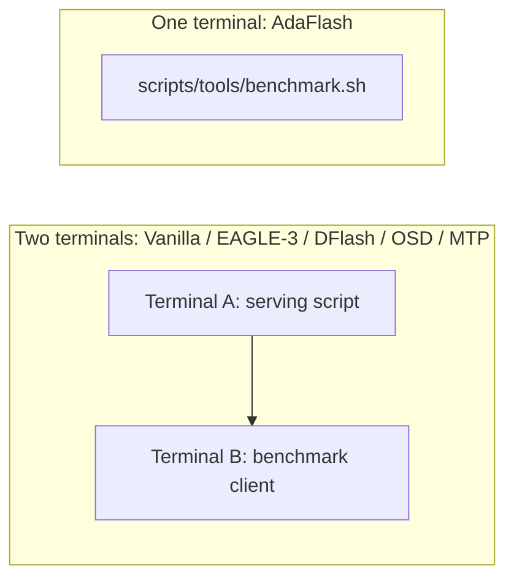

# HTTP Benchmark Experiments

This guide describes how to benchmark throughput, latency, accuracy, and speculative-decoding statistics against an SGLang `/generate` endpoint. It covers Vanilla autoregressive decoding, EAGLE-3, DFlash, MTP, OSD, and AdaFlash.

All commands assume that the current working directory is the repository root.

## 1. Prerequisites

Install the environment described in the project [README](../README.md), then prepare the required benchmark split:

```bash
python bin/prepare_data.py --dataset gsm8k
```

The benchmark client reads `test_data/<dataset>_test.jsonl`. Dataset preparation writes this file together with the corresponding training split.

Define common variables for a manual two-terminal experiment:

```bash
export PY=${PYTHON:-python}
export PORT=6784
export MODEL_PATH=Qwen/Qwen3-8B
```

Use the same `PORT` in the server and client terminals. The one-command AdaFlash launcher chooses a random port automatically and does not require this setup.

## 2. Experiment Matrix

### Target models

| Model family | `MODEL_PATH` |
|---|---|
| Qwen3-8B | `Qwen/Qwen3-8B` |
| Qwen3-Coder-30B | `Qwen/Qwen3-Coder-30B-A3B-Instruct` |
| Qwen3.5-9B | `Qwen/Qwen3.5-9B` |

### Benchmark datasets

The client has built-in paths for:

- reasoning: `gsm8k`, `math_qa`, `math500`, `aime25`;
- code: `opencodeinstruct`, `codealpaca`, `humaneval`, `mbpp`;
- chat and mixed workloads: `sharegpt`, `mt-bench`, `myblend`, `perfectblend`.

Accuracy evaluation is implemented for `gsm8k`, `math_qa`, `math500`, and `aime25`.

### Methods

| Method | Description |
|---|---|
| **Vanilla** | Standard autoregressive decoding without speculation |
| **EAGLE-3** | EAGLE-3 speculative drafter |
| **DFlash** | Official z-lab DFlash drafter |
| **MTP** | Qwen3.5 native MTP path |
| **OSD** | SFT-trained on-policy DFlash drafter |
| **AdaFlash** | Reverse-KL drafter with an adaptive length head |

### Concurrency

The standard comparison uses concurrency values **1, 32, 64, and 128**. Keep all other sampling and server settings fixed when comparing methods.

## 3. Benchmark Client

The common client command is:

```bash
"$PY" bin/benchmark.py \
  --base-url "http://127.0.0.1:${PORT}" \
  --model "$MODEL_PATH" \
  --dataset gsm8k \
  --max-samples 1024 \
  --num-prompts 1024 \
  --concurrency 64
```

Useful options include:

| Option | Description |
|---|---|
| `--eval-accuracy` | Evaluate answers for supported reasoning datasets |
| `--enable-thinking` | Enable the model's thinking chat template |
| `--max-new-tokens N` | Set the per-request generation limit |
| `--temperature T` | Set sampling temperature |
| `--top-p P` | Set nucleus-sampling probability |
| `--top-k K` | Set top-k sampling |
| `--no-warmup` | Skip the concurrency-sized warmup batch |

Use `--enable-thinking` only when the target and drafter were trained and evaluated with compatible thinking traces.

## 4. Execution Modes



- **Manual mode:** keep the server running in terminal A and execute one or more client experiments in terminal B.
- **One-command mode:** `scripts/tools/benchmark.sh` starts AdaFlash, waits for readiness, runs the client, and terminates the server.

## 5. Vanilla Autoregressive Decoding

In terminal A:

```bash
export MODEL_PATH=Qwen/Qwen3-8B
export PORT=6784
bash scripts/serve/serve_sglang.sh
```

In terminal B:

```bash
export MODEL_PATH=Qwen/Qwen3-8B
export PORT=6784

python bin/benchmark.py \
  --base-url "http://127.0.0.1:${PORT}" \
  --model "$MODEL_PATH" \
  --dataset gsm8k \
  --max-samples 1024 \
  --num-prompts 1024 \
  --concurrency 64 \
  --eval-accuracy
```

## 6. EAGLE-3

Use the launcher matching the target model:

| Target model | Server command |
|---|---|
| Qwen3-8B | `bash scripts/serve/serve_eagle3_qwen3_8b.sh` |
| Qwen3-Coder-30B | `bash scripts/serve/serve_eagle3_qwen3_coder.sh` |
| Qwen3.5-9B | `bash scripts/serve/serve_eagle3_qwen3.5_9b.sh` |

Run the same benchmark client as in the Vanilla experiment, with the corresponding `MODEL_PATH`.

## 7. Official DFlash

In terminal A:

```bash
export PORT=6784
export MODEL_PATH=Qwen/Qwen3-8B
export DRAFT_MODEL_PATH=z-lab/Qwen3-8B-DFlash-b16
bash scripts/serve/serve_dflash.sh
```

Recommended target/draft pairs are:

| Target model | `DRAFT_MODEL_PATH` |
|---|---|
| `Qwen/Qwen3-8B` | `z-lab/Qwen3-8B-DFlash-b16` |
| `Qwen/Qwen3-Coder-30B-A3B-Instruct` | `z-lab/Qwen3-Coder-30B-A3B-DFlash` |
| `Qwen/Qwen3.5-9B` | `z-lab/Qwen3.5-9B-DFlash` |

In terminal B, run the common client command with the matching target model.

## 8. Qwen3.5 MTP

MTP is available for the Qwen3.5 path:

```bash
export PORT=6784
export MODEL_PATH=Qwen/Qwen3.5-9B
bash scripts/serve/serve_mtp_qwen3.5_9b.sh
```

Benchmark it with `--model Qwen/Qwen3.5-9B`.

## 9. OSD

OSD uses the regular DFlash serving path with an SFT-trained draft checkpoint:

```bash
export PORT=6784
export MODEL_PATH=Qwen/Qwen3-8B
export DRAFT_MODEL_PATH=/path/to/osd/model_weights
bash scripts/serve/serve_dflash.sh
```

The expected draft path depends on the output directory used for asynchronous SFT training. Keep the target model, dataset, sampling parameters, and concurrency identical to the DFlash and AdaFlash runs.

## 10. AdaFlash

### One-command benchmark

```bash
export MODEL_PATH=Qwen/Qwen3-8B
export DRAFT_MODEL_PATH=d3LLM-model/Qwen3-8B-PerfectBlend-Full-RKL-v3
export DATASET=gsm8k
export NUM_SAMPLES=1024
export CONCURRENCY=64

bash scripts/tools/benchmark.sh --eval-accuracy
```

The launcher selects a random port, starts `scripts/serve/serve_thresh_head.sh`, waits for `/get_model_info`, runs the benchmark client, and cleans up the server process group.

### Adaptive-length runtime settings

| Variable | Default | Description |
|---|---:|---|
| `CANDIDATE_LEN_MIN` | `1` | Minimum predicted candidate length |
| `THRESHOLD_RATE` | `1.3` | Adaptive length-head threshold multiplier |
| `DYNAMIC_VERIFY_LEN` | `1` | Enable dynamic verification length |
| `DYNAMIC_VERIFY_EMA_ALPHA` | `0.3` | EMA coefficient for dynamic verification |
| `MEM_FRACTION_STATIC` | `0.80` | SGLang static memory fraction |
| `NUM_SAMPLES` | `1024` | Benchmark prompt count |
| `CONCURRENCY` | `64` | Client concurrency |
| `SERVER_STARTUP_TIMEOUT_S` | `180` | Maximum server startup wait |
| `MAX_RUNNING_REQUESTS` | automatic | Optional explicit SGLang request limit |

For thinking-mode checkpoints:

```bash
export MODEL_PATH=Qwen/Qwen3-8B
export DRAFT_MODEL_PATH=/path/to/thinking-compatible/adaflash/model_weights
export DATASET=math500
export NUM_SAMPLES=500
export CONCURRENCY=1

bash scripts/tools/benchmark.sh --enable-thinking --eval-accuracy
```

## 11. Reading the Output

The final summary has the following form:

```text
==================================================
Backend:          sglang
Dataset:          gsm8k
Num prompts:      1024
Concurrency:      64
Total latency:    ...
Avg req latency:  ...
Output tokens:    ...
Avg TPS:          ...
Avg Accept Len:   ...
Avg Accept Rate:  ...
Avg Verify Len:   ...
Spec verify ct:   ...
==================================================
```

The most important fields are:

| Field | Meaning |
|---|---|
| `Avg TPS` | Aggregate output-token throughput over total benchmark latency |
| `Avg req latency` | Mean end-to-end request latency |
| `Avg Accept Len` | Average accepted speculative length per verification event |
| `Avg Accept Rate` | Accepted speculative tokens divided by verified candidates |
| `Avg Verify Len` | Average candidate length presented to the target verifier |
| `Spec verify ct` | Number of speculative verification events |
| `Accuracy` | Dataset accuracy when `--eval-accuracy` is enabled |

Compare throughput only after confirming that prompt count, output-token limit, sampling, accuracy protocol, and target outputs are equivalent across methods.

## 12. Recording Results

A useful result hierarchy is:

```text
results/
├── qwen3/
│   └── results_gsm8k.md
├── qwen3_coder/
└── qwen3_5/
```

For each `(method, dataset, concurrency)` run:

1. Copy the final summary immediately after the run.
2. Preserve the raw values printed by the client.
3. Record the exact target model, draft checkpoint, SGLang revision, GPU type, and environment overrides.
4. Keep a compact comparison table for TPS, latency, acceptance length, acceptance rate, and accuracy.
5. Retain the raw summary below the table for auditability.

If terminal output is long, capture the client output separately:

```bash
python bin/benchmark.py ... 2>&1 | tee /tmp/adaflash_benchmark.log
tail -n 50 /tmp/adaflash_benchmark.log
```

## 13. Automated Sweeps

After starting a server in terminal A, a simple concurrency sweep in terminal B looks like this:

```bash
for dataset in gsm8k math_qa perfectblend; do
  for concurrency in 1 32 64 128; do
    python bin/benchmark.py \
      --base-url "http://127.0.0.1:${PORT}" \
      --model "$MODEL_PATH" \
      --dataset "$dataset" \
      --max-samples 1024 \
      --num-prompts 1024 \
      --concurrency "$concurrency"
  done
done
```

Stop the old server before changing the method or target model. Reusing a port while another server still owns it can silently invalidate a sweep.

## 14. Troubleshooting

### Server startup timeout

Cold model downloads and CUDA graph capture can exceed the default startup window:

```bash
export SERVER_STARTUP_TIMEOUT_S=600
```

### CUDA JIT cannot find `libcudart`

Ensure that `CUDA_HOME` points to a complete CUDA toolkit and that its `lib64` directory contains `libcudart.so`. Pointing `CUDA_HOME` to a conda environment that contains `nvcc` but not the CUDA runtime library will fail at the final linker step.

### CUDA out of memory during verification

Reduce one or more of:

- `MEM_FRACTION_STATIC` to leave more dynamic workspace;
- `CONCURRENCY` and `MAX_RUNNING_REQUESTS`;
- the maximum generation length;
- the speculative verification block size.

Allocator fragmentation can sometimes be reduced with:

```bash
export PYTORCH_CUDA_ALLOC_CONF=expandable_segments:True
```

### Unexpectedly low acceptance

Before changing speculative-decoding code, verify the target model independently with a deterministic prompt. Confirm that:

- the target checkpoint produces coherent text without speculation;
- all Hugging Face weight shards match their expected LFS SHA-256 values;
- target and draft tokenizers are compatible;
- the prompt template and thinking mode match the drafter's training setup;
- the official DFlash baseline uses identical sampling and benchmark prompts.

## Path Reference

| Purpose | Path |
|---|---|
| Vanilla server | `scripts/serve/serve_sglang.sh` |
| DFlash/OSD server | `scripts/serve/serve_dflash.sh` |
| EAGLE-3 servers | `scripts/serve/serve_eagle3_*.sh` |
| Qwen3.5 MTP server | `scripts/serve/serve_mtp_qwen3.5_9b.sh` |
| AdaFlash server | `scripts/serve/serve_thresh_head.sh` |
| One-command AdaFlash benchmark | `scripts/tools/benchmark.sh` |
| Benchmark client | `bin/benchmark.py` |
| Test datasets | `test_data/<dataset>_test.jsonl` |
| Benchmark implementation | `pipeline/benchmark/run.py` |

For dataset generation, see [data_preparation.md](data_preparation.md). For the asynchronous training pipeline, see [README.md](README.md).
